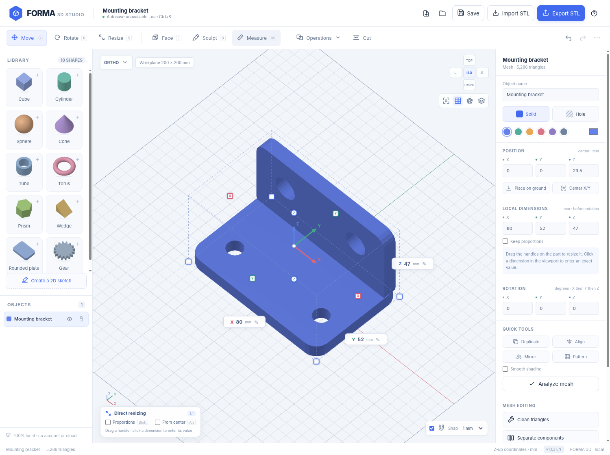

# FORMA 3D

### Local 3D modeling and STL editing — right in your browser

**Version 1.1.2 · HTML5 / CSS3 / JavaScript · Native WebGL · 100% Local & Self-Contained**

[](LICENSE)
[]()
[]()
[]()


---

FORMA 3D is a lightweight, self-contained 3D mesh editor for designing parts from geometric primitives and modifying imported STL files directly inside your web browser. Resize objects with intuitive on-canvas handles, combine solids, subtract hole volumes, extrude planar faces, sculpt details, and export clean STL files ready for your 3D slicer.

> **No account required · No cloud processing · No CDN assets · Zero runtime dependencies (no npm).**

---

## 📂 Repository Contents

This repository is designed to be minimal, ultra-portable, and instantly usable without any build toolchain:

| File | Description |
| :--- | :--- |
| **[`FORMA3D_EN.html`](FORMA3D_EN.html)** | **Complete standalone English application** (all HTML, CSS, JavaScript, WebGL renderer, CSG engine, and demo part in a single file). |
| **[`FORMA3D_FR.html`](FORMA3D_FR.html)** | **Complete standalone French application** (Édition autonome en français). |
| **[`FORMA3D_EN_Preview.png`](FORMA3D_EN_Preview.png)** | High-resolution user interface screenshot and preview image. |
| **[`LICENSE`](LICENSE)** | MIT Open Source License (Nicolas Hanteville & contributors). |
| **[`README.md`](README.md)** | User guide and comprehensive project documentation. |

---

## 🚀 Quick Start

### 1. Direct Launch (Easiest)
Simply double-click on **`FORMA3D_EN.html`** (or `FORMA3D_FR.html` for the French edition) to open it in any modern desktop browser (Google Chrome, Mozilla Firefox, Microsoft Edge, Safari, Brave, etc.) with hardware acceleration/WebGL enabled.

Because it is a single self-contained HTML file, you can keep it on a USB flash drive or offline drive and use it anywhere without an Internet connection.

### 2. Optional Local Web Server
Some strict corporate environments or browser privacy policies restrict Web Workers or IndexedDB storage on direct `file://` URLs. If needed, you can serve the directory using any lightweight static web server:

With **Python 3**:
```bash
python3 -m http.server 8080
```
Then navigate to: [http://127.0.0.1:8080/FORMA3D_EN.html](http://127.0.0.1:8080/FORMA3D_EN.html)

With **Node.js**:
```bash
npx serve .
```

*Note: All computation, CSG operations, and rendering take place locally inside your browser client. The server only delivers static files over loopback.*

---

## ✨ Features

| Area | Features & Included Tools |
| :--- | :--- |
| **Shape library** | 10 parametric primitives: cube/box, cylinder, sphere, cone/frustum, tube, torus, prism (3 to 32 sides), wedge, rounded plate, and decorative gear. |
| **Faithful previews** | Shape thumbnails dynamically rendered from exact primitive geometries with visible openings and proportions. |
| **Direct manipulation** | Move (`G`), rotate (`R`), resize handles (`S`), clickable on-canvas dimensions, grid snapping, and proportional scaling. |
| **2D sketches** | Interactive polygon drawing with draggable vertices on a snap grid, with direct Z extrusion. |
| **CSG Solid operations** | Union, subtraction, intersection, and automatic Solid / Hole roles. Retain hidden source objects if desired. |
| **Mesh editing** | Positive/negative planar face extrusion (`E`), plane slicing (`Cut`), connected component separation, and subdivision. |
| **Sculpting** | Inflate, deflate, smooth, and flatten brushes (`B`) with configurable radius and pressure. |
| **Inspection & Analysis** | Two-point caliper measurement (`M`), wireframe mode, X-ray transparency, smooth shading, and mesh watertightness diagnostics. |
| **STL Import & Export** | Binary and ASCII STL support, multi-file drag-and-drop, and automatic unit conversion (mm, cm, m, inches). |
| **Project management** | Native editable `.forma3d` format, session undo/redo, automatic IndexedDB session backup, and high-resolution PNG snapshots. |

---

## 💡 Common Workflows

### 1. Create and resize a part
1. Click any shape from the left library panel to add it to the scene.
2. Select the shape. Dimensioning handles appear automatically in **Move (`G`)** and **Resize (`S`)** modes.
   - **X, Y, Z face handles**: stretch or shrink along that axis while keeping the opposite side fixed.
   - **Bottom corner handles**: adjust width and depth simultaneously.
   - Hold **`Shift`** (or toggle *Proportions*) to scale all three dimensions uniformly.
   - Hold **`Alt`** (or toggle *From center*) to resize symmetrically around the center.
   - **Click any numerical dimension** in the 3D viewport to type an exact measurement in millimeters (`Enter` to apply, `Esc` to cancel).

### 2. Subtract a hole from a solid
1. Add or import your solid base part.
2. Add a cutting shape (e.g., a cylinder) and position it overlapping the part.
3. In the right-hand Inspector, switch its role from **Solid** to **Hole**.
4. Select both the solid part and the hole using **`Shift` + click**.
5. Choose **Operations → Merge / apply holes**.
6. The operation merges any solids and subtracts the hole volumes cleanly without adding unwanted geometry.

### 3. Modify an existing STL file
1. Click **Import STL**, select your file, and confirm its coordinate units (the editor operates internally in millimeters).
2. Use **Resize** to adjust dimensions, **Cut** to slice the mesh along a plane, **Face** to extrude planar surfaces, or **Sculpt** for localized surface shaping.
3. Click **Export STL** when ready (choose Binary format for faster slicing and smaller file size).

---

## ⌨️ Navigation & Keyboard Shortcuts

| Action | Mouse / Keyboard Input |
| :--- | :--- |
| **Select object** | Left click |
| **Add / remove from selection** | `Shift` + click |
| **Box selection** | `Shift` + drag background |
| **Camera orbit** | Right-drag or drag background |
| **Camera pan** | Middle-drag or `Alt` + drag |
| **Zoom** | Mouse wheel / pinch gesture |
| **Move / Rotate / Resize** | `G` / `R` / `S` |
| **Face / Sculpt / Measure** | `E` / `B` / `M` |
| **Frame selection in view** | `F` |
| **Undo / Redo** | `Ctrl + Z` / `Ctrl + Shift + Z` (or `Ctrl + Y`) |
| **Save / Open project** | `Ctrl + S` / `Ctrl + O` |
| **Duplicate object** | `Ctrl + D` |
| **Select all** | `Ctrl + A` |
| **Delete object** | `Delete` or `Backspace` |
| **Step move along grid** | Arrow keys (X/Y) · `Shift + ↑ / ↓` (Z) |
| **Cancel current tool/gesture** | `Esc` |

---

## ⚙️ Technical Limits & Specifications

FORMA 3D is a lightweight polyhedral mesh editor tailored for rapid 3D printing preparation and quick modifications. It is not an exact mechanical CAD B-rep kernel with parametric feature history (such as SolidWorks or FreeCAD).

- **Boolean complexity**: 80,000 combined triangles per operand pair.
- **STL file input**: up to 100 MB per file.
- **Geometry budget**: up to 1,200,000 triangles per object.
- **Batch import**: up to 20 STL files per import.
- **Project capacity**: up to 300 scene objects.
- **Direct dimensions range**: 0.01 mm to 100,000 mm.

---

## 📄 License & Attribution

Distributed under the **MIT License**. See [LICENSE](LICENSE) for details.

- **Author**: Nicolas Hanteville and FORMA 3D contributors.
- **CSG Engine**: The BSP solid boolean implementation adapts portions of **csg.js by Evan Wallace** (Copyright © 2011, MIT License).
